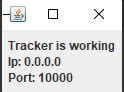
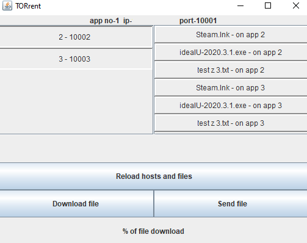

# TORrent

## About
Application with a graphic interface to share and send files between hosts.  
Implement features like:  
- Downloading file from the host
- Downloading same file but its different parts from many hosts at a time
- Sending file to the host
- Sending file to many hosts
- Download file progress bar
- Restarting download if was interrupted

## Run
To run app, you can either run jars or compile the program yourself from the source file

Application is based on TCP connection.  
To start app you need to firstly run the tracker. This class is supposed to keep track of all applications which are possible to connect with.  
Client app should be started after the tracker. In order to simulate real connection between many computers, there are being made 3 client classes in the main. Each one in a different thread.  
After start, new client class gets randomly chosen port with number between 10001 and 65535.
It tries to automatically connect with the tracker, whose port and ip address are hard-coded into client class.  
After establishing connection, tracker gives client class, individual number (next in line), and the list with all clients that have connected before.   
Numbers are counted in the tracker class.  
It is important to notice that if client class will be closed and then, it will reconnect, it will get a new number.

After receiving this information, client class creates list of other clients within itself,   
setup new client port which is 1000 + app number,   
folder to store files with address "D:\TORrent_ + app number",  
starts thread to listen for requests of any other client,  
loads up all files that are within its folder, 
asks other clients for files which may be downloaded.

## App usage
After starting tracker there should appear the frame indicating that tracker works correctly:  
  
  
Client frame looks like below:  
  
With information about app number, ip and port in the bar at the top.
On the left are listed hosts (other clients). There is possibility to click on one (to perform single host download/send) or more (to perform multi host download/send)  
On the right, are listed files and information on which host file is stored.
Below, after choosing file, there will appear check sum MD5
Reload hosts and files button is used to reconnect with the tracker and refresh hosts information.
Download button allows downloading selected file from the host or in parts if selected 2 or more hosts.
Send a file opens java file chooser to chose file which may be sent to selected host or hosts if 2 or more selected.  
Below is placed progress download bar which illustrates how much of file left until it will be downloaded.

After starting app there may appear information that no host was loaded.  
Action as in the communicate should be taken eg. pressed button to Reload hosts and files:

